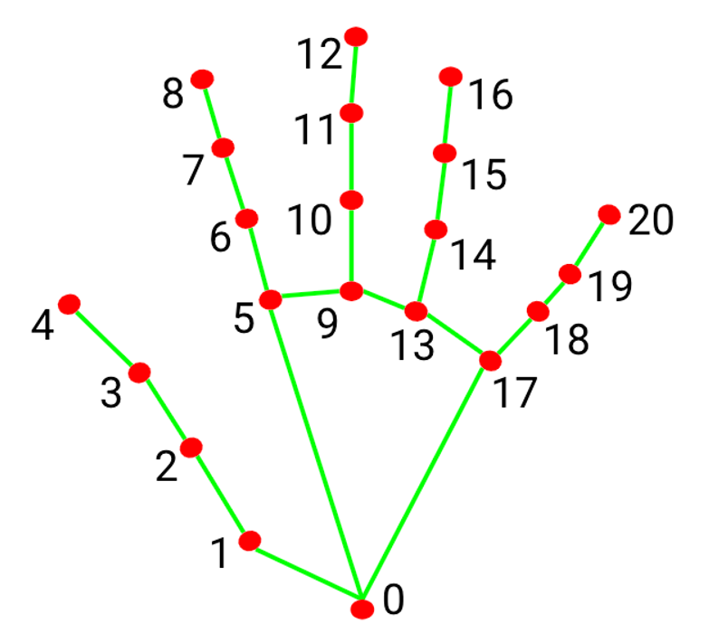

# 🖐️ Hand Gesture Classification

A real-time hand gesture recognition system using OpenCV, MediaPipe, and an SVM classifier.

## 📌 Project Overview

This project captures hand gestures from a webcam feed and classifies them using a trained Support Vector Machine (SVM) model. It leverages MediaPipe to detect 21 hand landmarks and uses those coordinates as input features for gesture prediction.

https://github.com/your-username/Computer-Vision-Explorer/assets/your-demo-path/output.mp4 *(Insert demo video here if you upload it)*

## 🧠 How It Works

- **MediaPipe** is used to extract 21 hand landmarks from the camera feed.
- The landmarks are normalized relative to the wrist (landmark 0) and the middle fingertip (landmark 12).
- The preprocessed data is passed to a trained **SVM** model to predict the gesture.
- The prediction is displayed live on the video stream.

### 🖼️ Landmark Reference



Each red dot represents a key point on the hand. The wrist is landmark 0, and the rest follow each finger up to the fingertips. These are used as features for gesture classification.

## 🛠️ Technologies Used

- Python
- OpenCV
- MediaPipe
- scikit-learn
- joblib

## 🚀 Running the Demo

1. Clone the repository:
   ```bash
   git clone https://github.com/your-username/Computer-Vision-Explorer.git
   cd Computer-Vision-Explorer/Hand-Gesture-Classification
   ```

2. Install the dependencies:
   ```bash
   pip install opencv-python mediapipe scikit-learn joblib numpy
   ```

3. Place your trained SVM model (`svm_winner.pkl`) in the project directory.

4. Run the script:
   ```bash
   python real_time_demo.py
   ```

5. Press `q` to exit the webcam window.

## 📁 File Structure

```
├── real_time_demo.py       # Main script to run the webcam-based classifier
├── svm_winner.pkl          # Pre-trained SVM model (not included)
├── img.png                 # Hand landmark reference image
├── output.mp4              # (Optional) Demo output video
└── README.md
```

## 📌 Applications

- Sign language interpretation
- Touchless UI systems
- AR/VR gesture control
- Educational tools

## 🙌 Credits

Developed by Mohammad Yaqoob — Part of the [Computer Vision Explorer](https://github.com/your-username/Computer-Vision-Explorer) repo.
